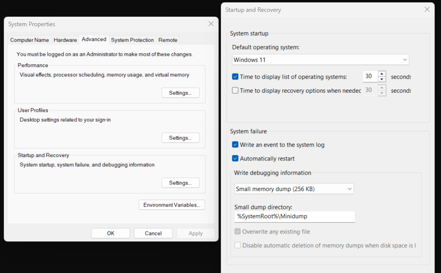

# Overview
The minidump-diagnostics tool is an Agent specialized in creating readable and citation based analyses of Windows Blue Screens specifically related to specific crash types such as Driver IRQL Violations and Page Faults. Thus it only supports creating crash reports for the **BUGCHECK_CODES** listed below. Any non-whitelisted code will be refused by the agent.

- (0xA, 0xD1, 0xC4, 0xC9, 0x50, 0x7E, 0x8E, 0x1E)

## Agent Functionality

The agent follows a structured pipeline for debugging Windows kernel crashes:

1. **Crash Type Validation**: Runs `!analyze -v` to extract the bugcheck code and validates it against supported crash types. Unsupported crashes are immediately rejected.

2. **Semantic Chunking & Vector Storage**: Uses Chonkie with local embeddings for semantic chunking of CDB command outputs, then stores these chunks as LangChain Documents in an InMemoryVectorStore with GoogleGenerativeAIEmbeddings for similarity search.

3. **Initial Analysis**: Processes the initial `!analyze -v` output through semantic chunking and generates structured citations in the format `[value_name] : description` with evidence-based reasoning.

4. **Iterative Command Execution**: The LLM selects appropriate commands from a whitelisted set of 9 essential debugging commands and validates parameters against previous outputs. Each command execution includes automatic context switching using extracted process/thread information.

5. **Context-Aware Prompting**: For each iteration, the model receives comprehensive context including:
   - Full initial `!analyze -v` output
   - Previously executed command and its output
   - All previously ran commands (by name)
   - Accumulated citations from prior analysis steps
   - RAG retrieval results based on LLM-generated queries
   - Remaining available commands from the whitelist
    
    The goal of the context-engineering is keep minimal but efficient usage of the model's context window. Taking advantage of citations and similarity search against outputs from previous commands allows the LLM to have only the most relevant context that it needs for its current decision while reducing the negative effects of the "noisy" outputs that can be generated by CDB. This also allows for future support for local models with smaller context windows.

6. **Avanced RAG-Enhanced Analysis**: The LLM generates targeted retrieval queries that are used to search the vector store for relevant debugging context for the next generated prompt.

7. **Citation Accumulation**: Progressive evidence is built where each analysis step produces structured citations that are stored and carried forward as context for future iterations, creating knowledge base of only the most relevant and important pieces of information from the crash for final analysis.

8. **Final Report**: Aggregates all accumulated citations into a comprehensive JSON analysis with root cause determination and confidence level assessment (Low/Medium/High). A final short explanation of the accumulated citations is meant to be digestable by those less familiar with the Windows kernel, allowing immediate action if possible along with focused context for technical users.

# Requirements

## API Keys
- Your API key for the agent, it must be a Google AI studio key for Gemini, specifically this agent uses Gemini 2.5 Flash: [Google AI Studio][google_ai_studio]

## Libraries
- **chonkie**
```bash
pip install chonkie[all]
```
- **google-genai**
```bash
pip install google-genai
```

- **langchain**
```bash
pip install langchain
```

- **langchain-gemini**
```bash
pip install langchain-gemini
```

- **langchain-google-genai**
```bash
pip install langchain-google-genai
```

- **python-dotenv**
```bash
pip install python-dotenv
```

## Windows Debugging Setup
- The Windows SDK must be installed for this Agent to run, specifically a compatible version of CDB can be installed from the [Windows SDK][windows_sdk]
- Minidump file generation must be activated for BSOD's
- Go to System Properties -> Advanced -> Startup and Recovery -> Settings and save this exact setup


## Setup
- Only two environment variables are required by creating a `.env` file at the root of the project.
- Your path to CDB should look something like "C:\Program Files (x86)\Windows Kits\10\Debuggers\x64\cdb.exe", as this the normal installation path for the Windows SDK
```bash
GOOGLE_API_KEY = "your_google_studio_api_key"
CDB_PATH = "full_path_to_cdb"
MINIDUMP_PATH = "full_path_to_your_minidump_file"
```

# Running the Program
- With the python runtime activated navigate to the project root and run
```
python ./src/main.py
```

## Logs
- Logs for the program in the terminal will show commands sent to CDB and the stdout retrieved. It will also show the chunks created for a specific command output and the number of chunks created. Prompts generated and sent to Gemini are also shown to the terminal along with the LLM's response, including the command and citations extracted.
- Output files for each run are saved in `command_outputs/{timestamp_of_run}-{date_of_minidump}/` which includes `.txt` files for the output of each command sent to CDB and a `final_analysis.json` report. 


# DISCLAIMER
- This tool uses local semantic chunking with Chonkie, so no external API dependencies for chunking are required.
- The only external API dependency is Google Gemini for LLM analysis.

[google_ai_studio]: https://aistudio.google.com/welcome?utm_source=PMAX&utm_medium=display&utm_campaign=FY25-global-DR-pmax-1710442&utm_content=pmax&gclsrc=aw.ds&gad_source=1&gad_campaignid=21521909442&gbraid=0AAAAACn9t67qd-s8lz130h6ggs1Ezvhjk&gclid=CjwKCAjwt-_FBhBzEiwA7QEqyN6IJ2X8If0t5-H-8jvyw1SwTAZvUGlM5Bx6-niQjjxqI7C9t6HSdhoCMm0QAvD_BwE

[windows_sdk]: https://developer.microsoft.com/en-us/windows/downloads/windows-sdk/
